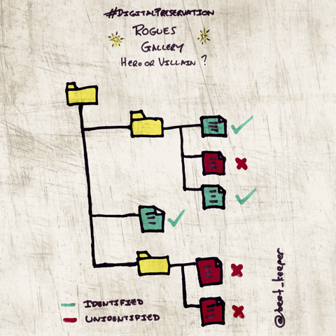
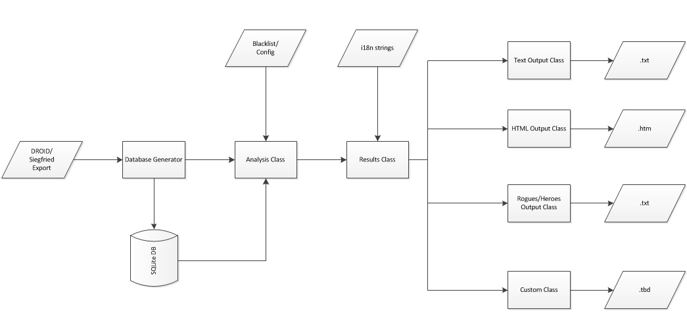

Analysis and reporting engine for digital preservation tools DROID and Siegfried
=====================

Working example [Siegfried]: [Siegfried Govdocs Select Results...](https://htmlpreview.github.io/?https://github.com/exponential-decay/droid-siegfried-sqlite-analysis-engine/blob/master/govdocs-selected-corpus-output/govdocs-select-sqlite-sf.htm)  
Working example [DROID]: [DROID Govdocs Select Results...](https://htmlpreview.github.io/?https://github.com/exponential-decay/droid-siegfried-sqlite-analysis-engine/blob/master/govdocs-selected-corpus-output/govdocs-select-sqlite-droid.htm)

Engine for analysis of [DROID CSV](https://github.com/digital-preservation/droid)
and [Seigfried](https://github.com/richardlehane/siegfried) export files. The tool has three
purposes, break the export into its components and store them within a set of tables
in a SQLite database; create additional columns to augment the output where useful;
and query the SQLite database, outputting results in a readable form useful for
analysis by researchers and archivists within digital preservation departments
in memory institutions.

See the following blogs for more information:

* [2014-06-03] On the creation of this tool: https://openpreservation.org/blog/2014/06/03/analysis-engine-droid-csv-export/
* [2015-08-25] On using the output of the tool to create a digital preservation rogues gallery: http://openpreservation.org/blog/2015/08/25/hero-or-villain-a-tool-to-create-a-digital-preservation-rogues-gallery/
* [2016-05-23] On the integration of Siegfried output for consistent and repeatable reporting: http://openpreservation.org/blog/2016/05/23/whats-in-a-namespace-the-marriage-of-droid-and-siegfried-analysis/
* [2016-05-24] On creating a multi-lingual dialect and exploring alternative identification methods: http://openpreservation.org/blog/2016/05/24/while-were-on-the-subject-a-few-more-points-of-interest-about-the-siegfrieddroid-analysis-tool/

COPTR Link: http://coptr.digipres.org/DROID_sqlite_analysis

There are three components to the tool:

#### droid2sqlite.py

Places DROID CSV export data into an SQLite database with the same filename
as the input.

Single argument: --export <input filename>

Translates a the results of DROID and Siegfried into a static SQLite Database
structure. A drastic change to the original tool, there are now five tables:

- DBMD - Database Metadata
- FILEDATA - File manifest and filesystem metadata
- IDDATA - Identification metadata
- IDRESULTS - FILEDATA/IDRESULTS junction table
- NSDATA - Namespace metadata, also secondary key (NS_ID) in IDDATA table

Will also augment DROID or Siegfried export data with additional columns amongst others:

URI_SCHEME: Separates the URI_SCHEME from the DROID URI column. This is to
enable the identification of container objects found in the export specifically,
and the distinction of files stored in container objects from standalone files.

DIR_NAME: Returns the base directory name from the filepath to enable
analysis of directory names, e.g. the number of directories in the collection.

#### droidsqliteanalysis.py

Combines the functions of droid2sqlite.py by calling droid2sqlite's primary
class. Further, queries a DROID sqlite database of the schema generated in
droid2sqlite, and outputs the result to stdout.

Two primary arguments:

* --export <input filename>

First creates a database like droid2sqlite then outputs a report.

* --db <input filename>

Outputs a report from a pre-existing sqlite database. **HTML** is output by default, and it's
a good idea to pipe this to a file, e.g.:

    python droidsqliteanalysis.py --db opf-with-text.db > my_html_file.htm

TXT can be output by using a --txt flag:

    python droidsqliteanalysis.py --db opf-with-text.db --txt > my_txt_file.txt

#### Rogues Gallery (v.0.2.0, v0.5.0+ : see [Releases...](https://github.com/exponential-decay/droid-sqlite-analysis/releases)

The following flags provide Rogue or Hero output:

* --rogues

Outputs a list of problematic files returned by DROID e.g. non-IDs, multiple IDs,
extension mismatches, zero-byte objects and duplicate files.

* --heroes

Outputs a list of files considered to be comparatively 'clean' in the context of
a DROID output, files will not be duplicates and will be positively identified using
Signature or Container mechanisms by DROID's standards.

More information can be found here: http://openpreservation.org/blog/2015/08/25/hero-or-villain-a-tool-to-create-a-digital-preservation-rogues-gallery/

#### MsoftFnameAnalysis.py

Class to handle analysis of non-recommended filenames from Microsoft:
http://msdn.microsoft.com/en-us/library/aa365247(VS.85).aspx

Code contains copy of library from Cooper Hewitt to enable writing of plain text
descriptions of characters: https://github.com/cooperhewitt/py-cooperhewitt-unicode

### Architecture

The tool is easily modified to create your own output by using the Analysis Results class
as a further abstaction layer (API).

The recent re-factor resulted in more generic python data structures being returned
from queries and less (if not zero) formatted output. This means a little more
work has to be put into presentation of results, but it is more flexibile to what
you want to do.

### Design Decisions

There are no dependencies associated with this tool other than what you download
with the repository. This has been driven by my previous two working environments
where installing Python was the first challenge... PIP and the ability to get hold
of code dependencies another - especially on multiple user's machines where we want
this tool to be successful.

### Usage Notes

Summary/Aggregate Binary / Text / Filename identification statistics are output with the following priority:

Namespace (e.g. ordered by PRONOM first [configurable])

1. Binary and Container Identifiers
2. XML Identifiers
3. Text Identifiers
4. Filename Identifiers
5. Extension Identifiers

We need to monitor how well this works. Namespace specific statistics are also output further down the report.

### TODO

* Internationalizing archivist descriptions, [Translation Link](https://docs.google.com/spreadsheets/d/1dVsRsXgD9V2GarNHHpf6Tzhrfx99_MXt3LjSSDrNLOY/edit?usp=sharing)
* Additional typing of database fields
* Improved container listing/handling
* Improved 'directory' listing and handling.
* Unit tests!

### License

Copyright (c) 2013 Ross Spencer

This software is provided 'as-is', without any express or implied warranty. In
no event will the authors be held liable for any damages arising from the use of
this software.

Permission is granted to anyone to use this software for any purpose, including
commercial applications, and to alter it and redistribute it freely, subject to
the following restrictions:

The origin of this software must not be misrepresented; you must not claim that
you wrote the original software. If you use this software in a product, an
acknowledgment in the product documentation would be appreciated but is not
required.

Altered source versions must be plainly marked as such, and must not be
misrepresented as being the original software.

This notice may not be removed or altered from any source distribution.
